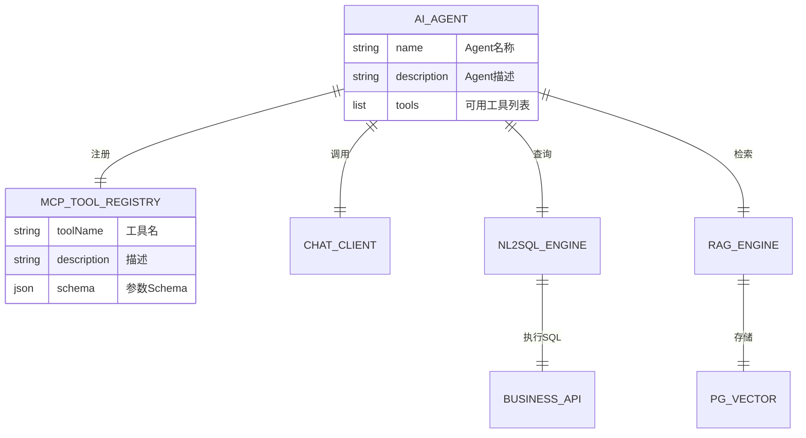

# 🚀 启航AI ERP —— AI原生ERP设计文档

> **版本**：v1.0 | **日期**：2026-07-02 | **状态**：规划中
>
> 本文档定义了将启航AI ERP从传统ERP重构为AI原生ERP的完整技术方案。

---

## 目录

1. [项目现状与定位](#1-项目现状与定位)
2. [总体架构设计](#2-总体架构设计)
3. [AI基础设施层](#3-ai基础设施层)
4. [AI Agent 体系](#4-ai-agent-体系)
5. [NL2SQL 智能查询引擎](#5-nl2sql-智能查询引擎)
6. [RAG 知识库系统](#6-rag-知识库系统)
7. [MCP Server 开放协议](#7-mcp-server-开放协议)
8. [智能供应链引擎](#8-智能供应链引擎)
9. [AI原生前端交互](#9-ai原生前端交互)
10. [数据库设计](#10-数据库设计)
11. [API 接口设计](#11-api-接口设计)
12. [实施路线图](#12-实施路线图)
13. [附录：代码示例](#13-附录代码示例)

---

## 1. 项目现状与定位

### 1.1 当前架构

```
qihang-ai-erp-open/
├── erp-api/          # API 层（Controller + 配置）
├── security/         # 安全认证（Spring Security）
├── common/           # 公共工具类
├── model/            # 实体类 + VO + DTO + 查询对象
├── mapper/           # MyBatis-Plus Mapper + XML
├── service/          # 业务逻辑层
├── open-sdk/         # 第三方平台SDK（淘宝/京东/拼多多/抖店/快手/小红书/微信小店）
└── vue2/             # 前端Vue 2 管理后台
```

### 1.2 已有AI基础

| 模块 | 文件/组件 | 状态 |
|------|----------|------|
| Spring AI 2.0 | pom.xml 依赖声明 | ✅ 已配置 |
| AI分析记录 | AiAnalysisRecord.java / Mapper | ✅ 实体+Mapper |
| AI会话历史 | AiConversationHistory.java | ✅ 实体 |
| AI用户角色 | AiUserRole.java | ✅ 实体 |
| SSE推送 | SseController.java | 🟡 骨架（返回"暂不支持"） |
| Ollama集成 | OllamaController.java | 🟡 基础查询模型 |
| AI角色管理 | AiUserRoleController.java | 🟡 骨架 |
| DeepSeek服务 | DeepSeekService.java | 🔴 全部注释 |
| 库存分析器 | InventorySalesAnalyzer.java | ✅ 独立Demo类 |
| 前端AI分析页 | views/ai/analysis.vue | 🟡 基础UI |
| 前端AI配置页 | views/ai/config.vue | 🟡 基础UI |
| 前端AI历史页 | views/ai/history.vue | 🟡 基础UI |
| 前端AI API | api/ai/analysis.js, config.js | 🟡 接口定义 |

### 1.3 设计原则

1. **渐进式增强**：不推翻现有业务，在现有模块上叠加AI能力
2. **MCP优先**：所有AI能力通过 MCP (Model Context Protocol) 暴露给外部AI
3. **可插拔模型**：支持 DeepSeek / OpenAI / Ollama / 通义千问等多种模型
4. **数据安全**：AI不直接访问原始数据，通过API层管控权限
5. **降级友好**：AI服务不可用时，自动降级到本地算法或规则引擎

---

## 2. 总体架构设计

### 2.1 六层架构

```
┌─────────────────────────────────────────────────────────────────────┐
│                        前端交互层 (Vue 2)                           │
│  ┌──────────────┐  ┌──────────────┐  ┌──────────────┐             │
│  │ 传统管理页面   │  │ AI对话面板   │  │ AI搜索栏     │             │
│  │ (现有菜单)    │  │ (Chat UI)    │  │ (⌘+K 全局)  │             │
│  └──────────────┘  └──────────────┘  └──────────────┘             │
│  ┌──────────────┐  ┌──────────────┐  ┌──────────────┐             │
│  │ 智能看板      │  │ 语音输入     │  │ AI配置中心   │             │
│  └──────────────┘  └──────────────┘  └──────────────┘             │
├─────────────────────────────────────────────────────────────────────┤
│                     API 网关层 (erp-api)                            │
│  ┌──────────────────────────────────────────────────────────────┐  │
│  │  /api/erp/*  → 业务API    /api/ai-agent/*  → AI API        │  │
│  │  /api/open/* → 开放API    /ws/ai/*         → WebSocket     │  │
│  └──────────────────────────────────────────────────────────────┘  │
├─────────────────────────────────────────────────────────────────────┤
│                     AI Agent 编排层                                  │
│  ┌──────────┐ ┌──────────┐ ┌──────────┐ ┌──────────┐ ┌──────────┐ │
│  │ 订单Agent│ │ 库存Agent│ │ 商品Agent│ │ 采购Agent│ │ 售后Agent│ │
│  └────┬─────┘ └────┬─────┘ └────┬─────┘ └────┬─────┘ └────┬─────┘ │
│       │             │            │             │            │        │
│  ┌────┴──────────────┴────────────┴─────────────┴──────────────┐  │
│  │                    MCP Tool Registry                         │  │
│  │  Tool定义 → Function Calling → 权限校验 → 执行 → 结果返回  │  │
│  └──────────────────────────────────────────────────────────────┘  │
├─────────────────────────────────────────────────────────────────────┤
│                     AI 核心能力层                                    │
│  ┌────────────────┐ ┌────────────────┐ ┌────────────────────────┐  │
│  │ ChatClient     │ │ NL2SQL 引擎    │ │ RAG 检索增强引擎        │  │
│  │ (Spring AI)   │ │ (LLM+Schema)   │ │ (PGVector + Embedding) │  │
│  └────────────────┘ └────────────────┘ └────────────────────────┘  │
│  ┌────────────────┐ ┌────────────────┐ ┌────────────────────────┐  │
│  │ 预测引擎        │ │ 规则引擎       │ │ Embedding 服务         │  │
│  │ (销量预测)     │ │ (降级备用)     │ │ (文本向量化)           │  │
│  └────────────────┘ └────────────────┘ └────────────────────────┘  │
├─────────────────────────────────────────────────────────────────────┤
│                     模型适配层                                        │
│  ┌──────────┐ ┌──────────┐ ┌──────────┐ ┌──────────┐ ┌──────────┐ │
│  │DeepSeek  │ │OpenAI    │ │Ollama    │ │通义千问  │ │文心一言  │ │
│  │(云端)    │ │(云端)    │ │(本地)    │ │(云端)    │ │(云端)    │ │
│  └──────────┘ └──────────┘ └──────────┘ └──────────┘ └──────────┘ │
├─────────────────────────────────────────────────────────────────────┤
│                     数据持久层                                        │
│  ┌────────────────┐ ┌────────────────┐ ┌────────────────────────┐  │
│  │ MySQL (业务)   │ │ Redis (缓存)   │ │ PostgreSQL+PGVector   │  │
│  │ 订单/商品/库存  │ │ 会话/令牌      │ │ 向量数据/知识库        │  │
│  └────────────────┘ └────────────────┘ └────────────────────────┘  │
└─────────────────────────────────────────────────────────────────────┘
```

### 2.2 核心模块依赖关系



---

## 3. AI基础设施层

### 3.1 Spring AI 2.0 配置

#### 3.1.1 Maven 依赖

```xml
<!-- pom.xml 父工程 -->
<properties>
    <spring-ai.version>2.0.0</spring-ai.version>
</properties>

<!-- erp-api/pom.xml 需要引入 -->
<dependency>
    <groupId>org.springframework.ai</groupId>
    <artifactId>spring-ai-openai-spring-boot-starter</artifactId>
    <version>${spring-ai.version}</version>
</dependency>
<!-- 或针对 DeepSeek（兼容OpenAI协议） -->
<dependency>
    <groupId>org.springframework.ai</groupId>
    <artifactId>spring-ai-openai-spring-boot-starter</artifactId>
    <version>${spring-ai.version}</version>
</dependency>
```

#### 3.1.2 application.yml 增加AI配置

```yaml
spring:
  ai:
    # DeepSeek（通过OpenAI兼容协议接入）
    openai:
      base-url: https://api.deepseek.com/v1
      api-key: ${DEEPSEEK_API_KEY:}
      chat:
        options:
          model: deepseek-chat
          temperature: 0.7
          max-tokens: 4096

    # Ollama 本地模型（可选）
    ollama:
      base-url: http://localhost:11434
      chat:
        options:
          model: qwen2.5:7b

    # 向量存储
    vectorstore:
      pgvector:
        index-type: ivfflat
        distance-type: cosine_distance
        dimension: 1536  # 取决于embedding模型

    # 重试配置
    retry:
      max-attempts: 3
      backoff:
        initial-interval: 1000
        multiplier: 2
        max-interval: 10000
```

#### 3.1.3 ChatClient 核心配置类

```java
@Configuration
public class AiConfig {

    /**
     * 主聊天客户端（用于一般对话）
     */
    @Bean
    @ConditionalOnProperty(name = "spring.ai.openai.api-key")
    public ChatClient chatClient(ChatClient.Builder builder) {
        return builder
            .defaultSystem("""
                你是启航AI ERP的AI助手，擅长处理电商业务问题。
                你可以查询订单、商品、库存信息，并进行分析和建议。
                请用专业、简洁的中文回答。
                """)
            .defaultAdvisors(new MessageChatMemoryAdvisor(
                new InMemoryChatMemory(), 10))
            .build();
    }

    /**
     * 分析专用客户端（低温度，更精确）
     */
    @Bean
    @ConditionalOnProperty(name = "spring.ai.openai.api-key")
    public ChatClient analysisChatClient(ChatClient.Builder builder) {
        return builder
            .defaultSystem("你是一个专业的电商数据分析师，请基于数据给出精确的洞察和建议。")
            .defaultOptions(OpenAiChatOptions.builder()
                .temperature(0.2)
                .build())
            .build();
    }
}
```

### 3.2 AI 服务抽象层

#### 3.2.1 核心接口

```java
/**
 * AI服务统一接口 - 所有AI调用都通过此接口
 */
public interface AiService {

    /**
     * 发送消息并获取回复
     * @param sessionId 会话ID
     * @param message   用户消息
     * @param context   上下文（店铺ID、商户ID等）
     * @return AI回复
     */
    AiResponse chat(String sessionId, String message, AiContext context);

    /**
     * 流式对话（SSE推送）
     */
    Flux<AiResponse> chatStream(String sessionId, String message, AiContext context);

    /**
     * 分析数据
     * @param type    分析类型
     * @param data    分析数据
     * @return 分析结果
     */
    AnalysisResult analyze(AnalysisType type, Map<String, Object> data);

    /**
     * 生成补货建议
     */
    ReplenishmentResult generateReplenishment(List<InventoryItem> items);
}

/**
 * AI上下文（包含当前用户的业务上下文）
 */
@Data
@Builder
public class AiContext {
    private Long userId;
    private Long merchantId;
    private Long shopId;
    private Long deptId;
    private String tenantId;
}
```

#### 3.2.2 模型路由实现

```java
/**
 * AI服务路由 - 根据配置动态选择模型
 */
@Service
@Slf4j
public class AiServiceRouter implements AiService {

    @Autowired(required = false)
    private ChatClient chatClient;          // 云端DeepSeek

    @Autowired(required = false)
    @Qualifier("ollamaChatClient")
    private ChatClient ollamaChatClient;    // 本地Ollama

    @Autowired
    private AiConfigMapper configMapper;

    private ChatClient getActiveClient() {
        // 1. 查数据库配置，获取用户选择的模型
        AiConfig config = configMapper.findActive();
        if (config == null) return chatClient;

        // 2. 根据配置路由
        return switch (config.getProvider()) {
            case "ollama" -> ollamaChatClient;
            case "deepseek" -> chatClient;
            case "openai" -> chatClient;
            default -> chatClient;
        };
    }

    @Override
    public AiResponse chat(String sessionId, String message, AiContext context) {
        ChatClient client = getActiveClient();
        if (client == null) {
            return AiResponse.fallback("AI服务未配置，请在系统设置中配置API Key");
        }
        // ... 调用client
    }
}
```

### 3.3 AI 分析记录与审计

```java
/**
 * AI分析记录服务 - 记录所有AI调用，用于审计和追溯
 */
@Service
@RequiredArgsConstructor
public class AiAnalysisRecordService {

    private final AiAnalysisRecordMapper recordMapper;

    /**
     * 记录AI分析请求
     */
    @Async
    public void recordAnalysis(AnalysisRecord record) {
        AiAnalysisRecord entity = new AiAnalysisRecord();
        entity.setAnalysisType(record.getType());
        entity.setAnalysisContent(record.getInput());
        entity.setPromptContent(record.getPrompt());
        entity.setStatus(0); // 分析中
        entity.setUserId(record.getUserId());
        entity.setMerchantId(record.getMerchantId());
        entity.setShopId(record.getShopId());
        entity.setCreatedTime(LocalDateTime.now());
        recordMapper.insert(entity);
    }

    /**
     * 更新分析结果
     */
    @Async
    public void updateResult(Long id, String result, Integer status, String error) {
        AiAnalysisRecord record = recordMapper.selectById(id);
        if (record != null) {
            record.setAnalysisResult(result);
            record.setStatus(status);
            record.setErrorMessage(error);
            record.setUpdatedTime(LocalDateTime.now());
            recordMapper.updateById(record);
        }
    }
}
```

---

## 4. AI Agent 体系

### 4.1 Agent 架构设计

每个Agent是一个独立的 Spring Bean，通过 `@Tool` 注解暴露能力，通过 MCP Registry 统一注册。

```java
/**
 * Agent 基础接口
 */
public interface ErpAgent {

    /**
     * Agent名称
     */
    String getName();

    /**
     * Agent描述（用于LLM选择Agent）
     */
    String getDescription();

    /**
     * 获取Agent支持的工具列表
     */
    List<ErpTool> getTools();
}

/**
 * 工具注解 - 标记可被AI调用的方法
 */
@Target(ElementType.METHOD)
@Retention(RetentionPolicy.RUNTIME)
public @interface ErpTool {
    String name() default "";
    String description();
    String[] parameters() default {};
}
```

### 4.2 订单Agent（核心）

```java
@Component
@Slf4j
public class OrderAgent implements ErpAgent {

    private final OrderService orderService;
    private final OrderItemService orderItemService;
    private final ShipService shipService;

    @Override
    public String getName() { return "订单助手"; }

    @Override
    public String getDescription() {
        return "处理订单相关查询和操作，包括查单、催单、改单、发货状态查询";
    }

    /**
     * 查询订单
     */
    @ErpTool(name = "queryOrder", description = "按订单号、收件人手机号、收件人姓名查询订单信息")
    public OrderVo queryOrder(
            @ToolParam(description = "订单号，如 JD202606010001") String orderNum,
            @ToolParam(description = "收件人手机号（和订单号二选一）") String receiverMobile,
            @ToolParam(description = "店铺ID，不传则查所有店铺") Long shopId) {

        LambdaQueryWrapper<OOrder> query = new LambdaQueryWrapper<OOrder>()
            .eq(StringUtils.hasText(orderNum), OOrder::getOrderNum, orderNum)
            .eq(StringUtils.hasText(receiverMobile), OOrder::getReceiverMobile, receiverMobile)
            .eq(shopId != null, OOrder::getShopId, shopId)
            .last("LIMIT 10");

        List<OOrder> orders = orderService.list(query);

        return OrderVo.builder()
            .total(orders.size())
            .orders(orders.stream().map(this::toDetail).toList())
            .build();
    }

    /**
     * 查询订单物流状态
     */
    @ErpTool(name = "trackShipment", description = "查询订单的物流发货状态")
    public ShipTrackVo trackShipment(
            @ToolParam(description = "订单号") String orderNum) {
        // 调用物流查询接口
        return shipService.queryLogistics(orderNum);
    }

    /**
     * 获取待发货订单
     */
    @ErpTool(name = "getPendingShipOrders", description = "获取待发货订单列表，可按店铺、时间范围筛选")
    public List<OOrder> getPendingShipOrders(
            @ToolParam(description = "店铺ID") Long shopId,
            @ToolParam(description = "天数，如7表示最近7天") Integer days) {
        return orderService.getPendingShipOrders(shopId, days);
    }

    /**
     * 统计订单数据
     */
    @ErpTool(name = "summarizeOrders", description = "按条件统计订单数量、金额等汇总数据")
    public OrderSummary summarizeOrders(
            @ToolParam(description = "统计维度：daily-按天, platform-按平台, status-按状态") String groupBy,
            @ToolParam(description = "开始日期 yyyy-MM-dd") String startDate,
            @ToolParam(description = "结束日期 yyyy-MM-dd") String endDate,
            @ToolParam(description = "店铺ID") Long shopId) {
        return orderService.summarize(groupBy, startDate, endDate, shopId);
    }
}
```

### 4.3 库存Agent

```java
@Component
public class InventoryAgent implements ErpAgent {

    private final GoodsInventoryService inventoryService;
    private final GoodsService goodsService;

    @Override
    public String getName() { return "库存助手"; }

    @Override
    public String getDescription() {
        return "查询库存状态、库存预警、补货建议、库存调拨建议";
    }

    @ErpTool(name = "queryStock", description = "查询商品库存信息，按商品名/SKU编码查询")
    public List<InventoryVo> queryStock(
            @ToolParam(description = "商品名称（模糊搜索）") String goodsName,
            @ToolParam(description = "SKU编码") String skuCode,
            @ToolParam(description = "仓库ID") Long warehouseId) {
        return inventoryService.queryStock(goodsName, skuCode, warehouseId);
    }

    @ErpTool(name = "getStockAlerts", description = "获取库存预警列表（低于安全库存的商品）")
    public List<StockAlertVo> getStockAlerts(
            @ToolParam(description = "预警类型：LOW-库存不足, OVER-库存过多, ALL-全部") String alertType) {
        return inventoryService.getStockAlerts(alertType);
    }

    @ErpTool(name = "suggestReplenishment", description = "为指定商品生成补货建议")
    public ReplenishmentVo suggestReplenishment(
            @ToolParam(description = "商品ID列表，不传则分析所有缺货商品") List<Long> goodsIds) {
        return inventoryService.generateReplenishmentSuggestions(goodsIds);
    }

    @ErpTool(name = "suggestTransfer", description = "生成多仓库间调拨建议，平衡库存")
    public List<TransferSuggestionVo> suggestTransfer() {
        return inventoryService.suggestTransfers();
    }
}
```

### 4.4 商品Agent

```java
@Component
public class ProductAgent implements ErpAgent {

    @Override
    public String getName() { return "商品助手"; }

    @Override
    public String getDescription() {
        return "查询商品信息、上下架状态、价格信息、商品数据分析";
    }

    @ErpTool(name = "searchProducts", description = "搜索商品，按名称、分类、品牌、价格范围搜索")
    public List<GoodsVo> searchProducts(
            @ToolParam(description = "搜索关键词") String keyword,
            @ToolParam(description = "分类ID") Long categoryId,
            @ToolParam(description = "品牌ID") Long brandId,
            @ToolParam(description = "价格下限（分）") Long minPrice,
            @ToolParam(description = "价格上限（分）") Long maxPrice) {
        return goodsService.search(keyword, categoryId, brandId, minPrice, maxPrice);
    }

    @ErpTool(name = "getProductSalesRank", description = "获取商品销量排行榜")
    public List<SalesRankVo> getProductSalesRank(
            @ToolParam(description = "排行维度：platform-按平台, total-按总销量") String dimension,
            @ToolParam(description = "时间范围：7d-近7天, 30d-近30天") String timeRange) {
        return goodsService.getSalesRank(dimension, timeRange);
    }
}
```

### 4.5 采购Agent

```java
@Component
public class PurchaseAgent implements ErpAgent {

    @Override
    public String getName() { return "采购助手"; }

    @Override
    public String getDescription() {
        return "采购订单管理、供应商管理、采购建议";
    }

    @ErpTool(name = "queryPurchaseOrders", description = "查询采购单")
    public List<PurchaseOrderVo> queryPurchaseOrders(
            @ToolParam(description = "采购单号") String purchaseNum,
            @ToolParam(description = "供应商ID") Long supplierId,
            @ToolParam(description = "状态：0-待审核,1-已审核,2-已入库") Integer status) {
        return purchaseService.queryOrders(purchaseNum, supplierId, status);
    }

    @ErpTool(name = "suggestPurchase", description = "根据库存和销售数据生成采购建议单")
    public PurchaseSuggestionVo suggestPurchase() {
        return purchaseService.generateSuggestions();
    }
}
```

### 4.6 售后Agent

```java
@Component
public class AfterSaleAgent implements ErpAgent {

    @Override
    public String getName() { return "售后助手"; }

    @Override
    public String getDescription() {
        return "处理售后/退款查询、原因分析、退款审核辅助";
    }

    @ErpTool(name = "queryRefunds", description = "查询退款/售后单")
    public List<RefundVo> queryRefunds(
            @ToolParam(description = "退款单号") String refundNum,
            @ToolParam(description = "订单号") String orderNum,
            @ToolParam(description = "状态") Integer status) {
        return refundService.queryRefunds(refundNum, orderNum, status);
    }

    @ErpTool(name = "analyzeRefundReasons", description = "分析退款原因分布，帮助改善商品和服务")
    public RefundAnalysisVo analyzeRefundReasons(
            @ToolParam(description = "时间范围：30d, 90d, 180d") String timeRange) {
        return refundService.analyzeReasons(timeRange);
    }
}
```

### 4.7 Agent 注册与调度中心

```java
/**
 * Agent注册中心 - 管理所有Agent的注册和调度
 */
@Component
@Slf4j
public class AgentRegistry implements InitializingBean {

    private final Map<String, ErpAgent> agentMap = new ConcurrentHashMap<>();
    private final List<ErpTool> allTools = new CopyOnWriteArrayList<>();

    @Autowired
    private List<ErpAgent> agents;

    @Override
    public void afterPropertiesSet() {
        for (ErpAgent agent : agents) {
            agentMap.put(agent.getName(), agent);
            log.info("注册Agent: {} - {}", agent.getName(), agent.getDescription());
        }
        // 收集所有Tool
        for (ErpAgent agent : agents) {
            Method[] methods = agent.getClass().getMethods();
            for (Method method : methods) {
                ErpTool tool = method.getAnnotation(ErpTool.class);
                if (tool != null) {
                    allTools.add(new ErpTool(agent.getName(), tool.name(), tool.description(), method));
                }
            }
        }
        log.info("共注册 {} 个Agent，{} 个Tool", agents.size(), allTools.size());
    }

    /**
     * 获取所有Agent
     */
    public List<ErpAgent> getAllAgents() { return List.copyOf(agents); }

    /**
     * 获取所有Tool定义（用于构建Function Calling）
     */
    public List<ErpTool> getAllTools() { return List.copyOf(allTools); }

    /**
     * 根据名称获取Agent
     */
    public ErpAgent getAgent(String name) { return agentMap.get(name); }
}
```

---

## 5. NL2SQL 智能查询引擎

### 5.1 架构设计

```
用户提问                    AI分析                     SQL执行
"上个月哪个商品            ┌──────────┐              ┌──────────┐
 卖得最好？"               │ 意图识别  │ ── Schema ─→│ SQL生成  │
     │                    └────┬─────┘              └────┬─────┘
     │                         │                         │
     ▼                         ▼                         ▼
┌──────────┐           ┌──────────────┐          ┌──────────────┐
│ 输入解析  │           │ LLM 分析      │          │ 安全执行      │
│ 提取意图  │           │ 生成SQL      │          │ 权限校验      │
└──────────┘           └──────────────┘          └──────┬───────┘
                                                         │
                                                         ▼
                                                  ┌──────────────┐
                                                  │ 结果解释      │
                                                  │ 自然语言输出  │
                                                  └──────────────┘
```

### 5.2 表结构元数据管理

```java
/**
 * 数据库表元数据 - 用于NL2SQL的Schema注入
 */
@Component
public class DatabaseSchemaProvider {

    /**
     * 获取业务表结构描述（用于AI提示词）
     */
    public String getSchemaDescription() {
        return """
            数据库表结构说明（电商ERP系统）：
            
            1. 订单表 (o_order)
               - id: 主键
               - order_num: 订单号 (如 JD202606010001)
               - shop_id: 店铺ID (关联 o_shop)
               - receiver_name: 收件人姓名
               - receiver_mobile: 收件人手机号
               - receiver_address: 收件人地址
               - total_amount: 订单总金额（分）
               - order_status: 订单状态 (0-待付款,1-已付款,2-已发货,3-已完成,4-已取消)
               - order_time: 下单时间
               - platform: 平台 (tao/jd/pdd/dou/wei/kwai/xhs)
               
            2. 订单明细表 (o_order_item)
               - id: 主键
               - order_id: 订单ID
               - sku_id: SKU ID
               - goods_name: 商品名称
               - sku_name: 规格名称
               - quantity: 数量
               - item_amount: 金额（分）
               
            3. 商品表 (erp_goods)
               - id: 主键
               - goods_title: 商品标题
               - category_id: 分类ID
               - brand_id: 品牌ID
               - price: 价格（分）
               
            4. 商品SKU表 (erp_goods_spec)
               - id: 主键
               - goods_id: 商品ID
               - spec_name: 规格名称
               - price: 价格（分）
               - stock_num: 库存数量
               
            5. 店铺表 (o_shop)
               - id: 主键
               - name: 店铺名称
               - platform: 平台类型
               - merchant_id: 商户ID
               
            6. 库存表 (erp_inventory)
               - id: 主键
               - sku_id: SKU ID
               - warehouse_id: 仓库ID
               - quantity: 当前库存
               - safety_stock: 安全库存
               
            7. 退款/售后表 (o_refund)
               - id: 主键
               - refund_num: 退款单号
               - order_id: 订单ID
               - refund_status: 状态
               - refund_amount: 退款金额（分）
               - refund_reason: 退款原因
               - created_time: 创建时间
            """;
    }

    /**
     * 获取表关系描述
     */
    public String getRelationDescription() {
        return """
            表关系说明：
            - o_order.shop_id = o_shop.id
            - o_order.id = o_order_item.order_id
            - o_order_item.sku_id = erp_goods_spec.id
            - erp_goods_spec.goods_id = erp_goods.id
            - erp_goods_spec.id = erp_inventory.sku_id
            - o_refund.order_id = o_order.id
            """;
    }
}
```

### 5.3 NL2SQL 核心引擎

```java
/**
 * NL2SQL 引擎 - 将自然语言转换为SQL查询
 */
@Service
@Slf4j
@RequiredArgsConstructor
public class Nl2SqlEngine {

    private final ChatClient chatClient;
    private final DatabaseSchemaProvider schemaProvider;
    private final SqlSecurityValidator sqlValidator;
    private final JdbcTemplate jdbcTemplate;

    /**
     * 自然语言查询
     * @param question 用户问题
     * @param context  业务上下文
     * @return 查询结果（自然语言解释）
     */
    public Nl2SqlResult query(String question, AiContext context) {
        // 1. 构建提示词
        String prompt = buildPrompt(question, context);

        // 2. 调用LLM生成SQL
        String sql = generateSql(prompt);

        // 3. 安全校验
        SqlValidationResult validation = sqlValidator.validate(sql, context);
        if (!validation.isPassed()) {
            return Nl2SqlResult.error("查询不合法: " + validation.getReason());
        }

        // 4. 执行SQL
        try {
            List<Map<String, Object>> rows = jdbcTemplate.queryForList(sql);
            if (rows.isEmpty()) {
                return Nl2SqlResult.success("没有找到相关数据", null);
            }
            // 5. 将结果转为自然语言
            String explanation = explainResult(question, sql, rows);
            return Nl2SqlResult.success(explanation, rows);
        } catch (Exception e) {
            log.error("SQL执行失败: {}", sql, e);
            // 重试：把错误信息返回给LLM，让它修正SQL
            String fixedSql = fixSql(sql, e.getMessage());
            if (fixedSql != null) {
                List<Map<String, Object>> rows = jdbcTemplate.queryForList(fixedSql);
                String explanation = explainResult(question, fixedSql, rows);
                return Nl2SqlResult.success(explanation, rows);
            }
            return Nl2SqlResult.error("查询执行失败: " + e.getMessage());
        }
    }

    private String buildPrompt(String question, AiContext context) {
        return """
            你是一个熟练的MySQL SQL工程师。请根据用户的问题，生成对应的SQL查询语句。

            ## 数据库Schema
            %s

            ## 表关系
            %s

            ## 业务约束
            - 商户ID = %d
            - 只能查询，不能执行INSERT/UPDATE/DELETE/ALTER/DROP等操作
            - 只返回SQL代码，不要解释

            ## 用户问题
            %s

            ## 注意
            - 只返回SQL代码，不要包含markdown标记
            - 使用别名
            - 查询结果限制最多100条
            """
            .formatted(
                schemaProvider.getSchemaDescription(),
                schemaProvider.getRelationDescription(),
                context.getMerchantId(),
                question
            );
    }

    private String generateSql(String prompt) {
        return chatClient.prompt()
            .user(prompt)
            .call()
            .content();
    }

    private String explainResult(String question, String sql, List<Map<String, Object>> rows) {
        // 将结果和原始问题发给LLM，生成自然语言解释
        String explainPrompt = """
            用户问题：%s
            执行的SQL：%s
            查询结果：%s
            请用简洁的自然语言回答用户的问题，基于查询结果给出具体数据。
            """
            .formatted(question, sql, JSON.toJSONString(rows));

        return chatClient.prompt()
            .user(explainPrompt)
            .call()
            .content();
    }

    private String fixSql(String sql, String errorMsg) {
        // 将错误信息发给LLM，让它修正SQL
        String fixPrompt = """
            以下SQL执行报错：
            SQL: %s
            错误: %s
            请修正SQL，只返回修正后的SQL语句。
            """.formatted(sql, errorMsg);

        return chatClient.prompt()
            .user(fixPrompt)
            .call()
            .content();
    }
}
```

### 5.4 SQL 安全校验器

```java
/**
 * SQL安全校验器 - 防止SQL注入和越权查询
 */
@Component
public class SqlSecurityValidator {

    private static final List<String> FORBIDDEN_KEYWORDS = List.of(
        "INSERT", "UPDATE", "DELETE", "DROP", "ALTER", "TRUNCATE",
        "CREATE", "GRANT", "REVOKE", "LOAD", "EXPORT", "INTO OUTFILE"
    );

    /**
     * 校验SQL安全性
     */
    public SqlValidationResult validate(String sql, AiContext context) {
        // 1. 禁止修改操作
        String upperSql = sql.toUpperCase();
        for (String keyword : FORBIDDEN_KEYWORDS) {
            if (upperSql.contains(keyword)) {
                return SqlValidationResult.fail("包含禁止的关键字: " + keyword);
            }
        }

        // 2. 强制限制查询条数
        if (!upperSql.contains("LIMIT")) {
            sql = sql + " LIMIT 100";
        }

        // 3. 注入商户ID过滤（多租户）
        if (context.getMerchantId() != null && !upperSql.contains("MERCHANT_ID")) {
            // 自动追加商户过滤条件
            sql = addMerchantFilter(sql, context.getMerchantId());
        }

        return SqlValidationResult.pass(sql);
    }

    private String addMerchantFilter(String sql, Long merchantId) {
        // 简单的WHERE追加（实际需更复杂的SQL解析）
        if (sql.toUpperCase().contains("WHERE")) {
            return sql + " AND merchant_id = " + merchantId;
        } else {
            return sql + " WHERE merchant_id = " + merchantId;
        }
    }
}
```

### 5.5 NL2SQL 使用示例

| 用户问题 | 生成的SQL | 说明 |
|---------|-----------|------|
| "上个月销量最好的5个商品" | `SELECT g.goods_title, SUM(oi.quantity) as total_qty FROM o_order o JOIN o_order_item oi ON o.id = oi.order_id JOIN erp_goods g ON oi.goods_id = g.id WHERE o.order_time >= '2026-06-01' AND o.order_time < '2026-07-01' GROUP BY g.id ORDER BY total_qty DESC LIMIT 5` | 按商品聚合销量 |
| "京东店铺还有多少单没发货" | `SELECT COUNT(*) as pending FROM o_order WHERE shop_id = (SELECT id FROM o_shop WHERE platform = 'jd' AND merchant_id = ?) AND order_status = 1` | 统计待发货 |
| "库存低于安全库存的商品" | `SELECT g.goods_title, s.spec_name, i.quantity, i.safety_stock FROM erp_inventory i JOIN erp_goods_spec s ON i.sku_id = s.id JOIN erp_goods g ON s.goods_id = g.id WHERE i.quantity < i.safety_stock` | 库存预警 |

---

## 6. RAG 知识库系统

### 6.1 架构设计

```
┌─────────────────────────────────────────────────────┐
│                   数据源                              │
│  ┌──────────┐ ┌──────────┐ ┌──────────┐ ┌────────┐ │
│  │ 商品手册  │ │ 运营规则  │ │ 帮助文档  │ │ FAQ    │ │
│  └────┬─────┘ └────┬─────┘ └────┬─────┘ └────┬───┘ │
│       │             │            │             │      │
│       ▼             ▼            ▼             ▼      │
│  ┌─────────────────────────────────────────────────┐ │
│  │               Document Reader                     │ │
│  │  (PDF / HTML / TXT / MD / CSV)                  │ │
│  └──────────────────────┬──────────────────────────┘ │
│                         │                             │
│                         ▼                             │
│  ┌─────────────────────────────────────────────────┐ │
│  │               Text Splitter                       │ │
│  │  (按段落/语义分块，每块500-1000 tokens)          │ │
│  └──────────────────────┬──────────────────────────┘ │
│                         │                             │
│                         ▼                             │
│  ┌─────────────────────────────────────────────────┐ │
│  │               Embedding 模型                      │ │
│  │  (DeepSeek / 通义千问 / BGE)                     │ │
│  └──────────────────────┬──────────────────────────┘ │
│                         │                             │
│                         ▼                             │
│  ┌─────────────────────────────────────────────────┐ │
│  │               PGVector 向量库                     │ │
│  │  (存储向量 + 原始文本 + 元数据)                   │ │
│  └─────────────────────────────────────────────────┘ │
└─────────────────────────────────────────────────────┘
```

### 6.2 知识库文档管理

```java
/**
 * 知识库文档管理
 */
@Service
@RequiredArgsConstructor
public class KnowledgeBaseService {

    private final VectorStore vectorStore;
    private final DocumentReaderService documentReader;

    /**
     * 上传文档到知识库
     */
    public void uploadDocument(MultipartFile file, String category, Long merchantId) {
        // 1. 读取文档
        List<Document> docs = documentReader.read(file);

        // 2. 元数据标记
        docs.forEach(doc -> {
            doc.getMetadata().put("merchant_id", merchantId);
            doc.getMetadata().put("category", category);
            doc.getMetadata().put("upload_time", LocalDateTime.now().toString());
        });

        // 3. 分块
        TokenTextSplitter splitter = new TokenTextSplitter(500, 100, 5, 1000, true);
        List<Document> chunks = splitter.apply(docs);

        // 4. 向量化并存储
        vectorStore.add(chunks);
    }

    /**
     * 检索相关知识
     */
    public List<Document> search(String query, int topK, Long merchantId) {
        SearchRequest request = SearchRequest.query(query)
            .withTopK(topK)
            .withFilterExpression("merchant_id == " + merchantId);

        return vectorStore.similaritySearch(request);
    }

    /**
     * 删除文档
     */
    public void deleteDocument(String documentId) {
        vectorStore.delete(List.of(documentId));
    }
}
```

### 6.3 RAG 增强问答

```java
/**
 * RAG 增强问答服务 - 结合知识库回答用户问题
 */
@Service
@RequiredArgsConstructor
public class RagService {

    private final VectorStore vectorStore;
    private final ChatClient chatClient;

    /**
     * 基于知识库回答
     */
    public String ask(String question, Long merchantId) {
        // 1. 检索相关知识
        List<Document> relevantDocs = vectorStore.similaritySearch(
            SearchRequest.query(question)
                .withTopK(5)
                .withFilterExpression("merchant_id == " + merchantId)
        );

        // 2. 构建上下文
        String context = relevantDocs.stream()
            .map(Document::getContent)
            .collect(Collectors.joining("\n\n---\n\n"));

        // 3. 生成回答
        return chatClient.prompt()
            .system("""
                你是一个专业的电商ERP客服助手。请基于以下提供的知识库内容回答用户问题。
                如果知识库中没有相关信息，请如实告知，不要编造答案。

                知识库内容：
                %s
                """.formatted(context))
            .user(question)
            .call()
            .content();
    }

    /**
     * 流式问答
     */
    public Flux<String> askStream(String question, Long merchantId) {
        List<Document> relevantDocs = vectorStore.similaritySearch(
            SearchRequest.query(question).withTopK(5)
        );
        String context = relevantDocs.stream()
            .map(Document::getContent)
            .collect(Collectors.joining("\n\n---\n\n"));

        return chatClient.prompt()
            .system("基于以下知识库回答：\n" + context)
            .user(question)
            .stream()
            .content();
    }
}
```

### 6.4 知识库管理页面功能

```
┌─────────────────────────────────────────────────────┐
│  知识库管理                                           │
│  ┌────────────────────────────────────────────────┐ │
│  │  [上传文档] [批量导入] [新建分类] [搜索]       │ │
│  ├────────────────────────────────────────────────┤ │
│  │  分类树              │ 文档列表                │ │
│  │  ├── 商品手册        │  ┌───┬────────┬───┬──┐ │ │
│  │  ├── 运营规则        │  │ # │ 名称   │ 分类│..│ │
│  │  ├── 帮助文档        │  ├───┼────────┼───┼──┤ │ │
│  │  ├── 售后话术        │  │ 1 │ 商品手册│商品│..│ │ │
│  │  └── 自定义          │  │ 2 │ 打包规则│运营│..│ │ │
│  │                      │  └───┴────────┴───┴──┘ │ │
│  └──────────────────────┴─────────────────────────┘ │
└─────────────────────────────────────────────────────┘
```

---

## 7. MCP Server 开放协议

### 7.1 MCP 协议概述

MCP (Model Context Protocol) 是 Anthropic 提出的开放协议，让AI模型能够安全地访问外部工具和数据源。

### 7.2 MCP Server 实现

```java
/**
 * MCP Server 配置 - 让 Claude/ChatGPT 可以直接操作ERP
 */
@Configuration
public class McpServerConfig {

    /**
     * MCP Server 定义
     * 暴露所有 ErpTool 作为 MCP Tool
     */
    @Bean
    public McpServer mcpServer(AgentRegistry agentRegistry) {
        McpServerSchema schema = new McpServerSchema();
        schema.setName("qihang-ai-erp");
        schema.setVersion("4.1.0");
        schema.setDescription("启航AI ERP系统 - 支持订单、商品、库存、采购等管理操作");

        // 注册所有Tool
        List<McpTool> tools = agentRegistry.getAllTools().stream()
            .map(this::toMcpTool)
            .toList();
        schema.setTools(tools);

        return new McpServer(schema);
    }

    private McpTool toMcpTool(ErpTool tool) {
        McpTool mcpTool = new McpTool();
        mcpTool.setName(tool.getName());
        mcpTool.setDescription(tool.getDescription());

        // 解析参数Schema
        Map<String, Object> inputSchema = new HashMap<>();
        // ... 从注解解析参数定义
        mcpTool.setInputSchema(inputSchema);

        return mcpTool;
    }
}
```

### 7.3 工具注册示例

```json
{
  "name": "qihang-ai-erp",
  "version": "4.1.0",
  "tools": [
    {
      "name": "queryOrder",
      "description": "按订单号或收件人手机号查询订单信息",
      "inputSchema": {
        "type": "object",
        "properties": {
          "orderNum": {
            "type": "string",
            "description": "订单号，如 JD202606010001"
          },
          "receiverMobile": {
            "type": "string",
            "description": "收件人手机号"
          }
        }
      }
    },
    {
      "name": "queryStock",
      "description": "查询商品库存信息",
      "inputSchema": {
        "type": "object",
        "properties": {
          "goodsName": {
            "type": "string",
            "description": "商品名称（模糊搜索）"
          },
          "skuCode": {
            "type": "string",
            "description": "SKU编码"
          }
        }
      }
    },
    {
      "name": "getStockAlerts",
      "description": "获取库存预警列表",
      "inputSchema": {
        "type": "object",
        "properties": {
          "alertType": {
            "type": "string",
            "enum": ["LOW", "OVER", "ALL"],
            "description": "预警类型"
          }
        }
      }
    },
    {
      "name": "suggestReplenishment",
      "description": "生成补货建议",
      "inputSchema": {
        "type": "object",
        "properties": {
          "goodsIds": {
            "type": "array",
            "items": {"type": "integer"},
            "description": "商品ID列表"
          }
        }
      }
    }
  ]
}
```

### 7.4 OpenAPI 3.0 规范

```yaml
openapi: 3.0.0
info:
  title: 启航AI ERP OpenAPI
  version: 4.1.0
  description: 供AI大模型和企业系统调用的开放接口

servers:
  - url: https://your-domain.com/api/open
    description: 生产环境

paths:
  /order/query:
    get:
      summary: 查询订单
      parameters:
        - name: orderNum
          in: query
          schema: { type: string }
        - name: receiverMobile
          in: query
          schema: { type: string }
        - name: page
          in: query
          schema: { type: integer, default: 1 }
        - name: pageSize
          in: query
          schema: { type: integer, default: 20 }
      responses:
        '200':
          description: 成功

  /inventory/query:
    get:
      summary: 查询库存
      parameters:
        - name: skuCode
          in: query
          schema: { type: string }
        - name: warehouseId
          in: query
          schema: { type: integer }
      responses:
        '200':
          description: 成功

  /inventory/alert:
    get:
      summary: 库存预警列表
      parameters:
        - name: type
          in: query
          schema: 
            type: string
            enum: [LOW, OVER, ALL]
      responses:
        '200':
          description: 成功

  /analysis/sales:
    post:
      summary: AI销售分析
      requestBody:
        content:
          application/json:
            schema:
              type: object
              properties:
                startDate: { type: string }
                endDate: { type: string }
                shopId: { type: integer }
      responses:
        '200':
          description: 分析报告
```

---

## 8. 智能供应链引擎

### 8.1 销量预测

```java
/**
 * 销量预测服务
 * 使用LLM + 时间序列分析预测未来销量
 */
@Service
@Slf4j
@RequiredArgsConstructor
public class SalesForecastService {

    private final OrderService orderService;
    private final ChatClient chatClient;

    /**
     * 预测商品销量
     * @param skuId     SKU ID
     * @param days      预测天数
     * @return 预测结果
     */
    public ForecastResult forecast(Long skuId, int days) {
        // 1. 获取历史销售数据（最近90天）
        List<DailySales> history = orderService.getDailySalesBySku(skuId, 90);

        // 2. 构建预测提示词
        String prompt = buildForecastPrompt(history, days);

        // 3. 调用LLM生成预测
        String response = chatClient.prompt()
            .system("你是一个电商销量预测专家，请基于历史数据给出未来销量预测，返回JSON格式。")
            .user(prompt)
            .call()
            .content();

        // 4. 解析结果
        return ForecastResult.parse(response);
    }

    private String buildForecastPrompt(List<DailySales> history, int days) {
        return """
            请基于以下历史销售数据，预测未来%d天的日销量。

            历史数据（近90天，按天汇总）：
            %s

            请返回JSON格式：
            {
                "forecast": [
                    {"date": "2026-07-03", "predicted_sales": 45, "confidence": 0.85},
                    ...
                ],
                "total_predicted": 350,
                "trend": "upward/downward/stable",
                "risk_factors": ["临近节假日", "季节性波动"],
                "suggested_safety_stock": 200
            }
            """.formatted(days, JSON.toJSONString(history));
    }
}
```

### 8.2 智能补货建议

```java
/**
 * 智能补货引擎
 */
@Service
@RequiredArgsConstructor
public class ReplenishmentEngine {

    private final SalesForecastService forecastService;
    private final InventoryService inventoryService;
    private final PurchaseService purchaseService;

    /**
     * 生成补货建议
     */
    public ReplenishmentPlan generatePlan(Long merchantId) {
        // 1. 获取所有库存低于安全库存的商品
        List<InventoryAlert> alerts = inventoryService.getAlerts(merchantId, "LOW");

        List<ReplenishmentItem> items = new ArrayList<>();

        for (InventoryAlert alert : alerts) {
            // 2. 预测未来30天销量
            ForecastResult forecast = forecastService.forecast(alert.getSkuId(), 30);

            // 3. 计算建议补货量
            int suggestedQty = calculateSuggestedQty(alert, forecast);

            // 4. 查询在途采购
            int inTransit = purchaseService.getInTransitQty(alert.getSkuId());

            items.add(ReplenishmentItem.builder()
                .skuId(alert.getSkuId())
                .goodsName(alert.getGoodsName())
                .skuName(alert.getSkuName())
                .currentStock(alert.getQuantity())
                .safetyStock(alert.getSafetyStock())
                .forecastSales(forecast.getTotalPredicted())
                .inTransitQty(inTransit)
                .suggestedQty(suggestedQty)
                .urgency(determineUrgency(alert, forecast))
                .build());
        }

        return ReplenishmentPlan.builder()
            .merchantId(merchantId)
            .generatedAt(LocalDateTime.now())
            .items(items)
            .summary(buildSummary(items))
            .build();
    }

    private int calculateSuggestedQty(InventoryAlert alert, ForecastResult forecast) {
        int forecastSales = forecast.getTotalPredicted();
        int currentStock = alert.getQuantity();
        int inTransit = purchaseService.getInTransitQty(alert.getSkuId());
        int safetyStock = alert.getSafetyStock();

        // 补货量 = 预测销量 + 安全库存 - 当前库存 - 在途
        int suggested = Math.max(forecastSales + safetyStock - currentStock - inTransit, 0);
        // 向上取整到最小起订量
        return Math.max(suggested, alert.getMinOrderQty());
    }

    private String determineUrgency(InventoryAlert alert, ForecastResult forecast) {
        double coverDays = alert.getQuantity() / Math.max(forecast.getDailyAvg(), 0.1);
        if (coverDays < 3) return "紧急";
        if (coverDays < 7) return "高";
        if (coverDays < 14) return "中";
        return "低";
    }
}
```

### 8.3 智能调拨建议

```java
/**
 * 多仓库智能调拨引擎
 */
@Service
public class TransferSuggestionEngine {

    /**
     * 生成调拨建议
     * 逻辑：A仓库存过多，B仓库存不足时，建议从A调拨到B
     */
    public List<TransferSuggestion> suggestTransfers(Long merchantId) {
        // 1. 获取所有仓库库存
        List<WarehouseStock> allStocks = inventoryService.getAllWarehouseStocks(merchantId);

        // 2. 按SKU分组，分析各仓库库存分布
        Map<Long, List<WarehouseStock>> bySku = allStocks.stream()
            .collect(Collectors.groupingBy(WarehouseStock::getSkuId));

        List<TransferSuggestion> suggestions = new ArrayList<>();

        for (Map.Entry<Long, List<WarehouseStock>> entry : bySku.entrySet()) {
            List<WarehouseStock> stocks = entry.getValue();

            // 找出库存过多的仓库和库存不足的仓库
            for (WarehouseStock stock : stocks) {
                if (stock.getQuantity() > stock.getMaxStock()) {
                    // 库存过多，可以调出
                    int overstock = stock.getQuantity() - stock.getMaxStock();

                    for (WarehouseStock target : stocks) {
                        if (target.getQuantity() < target.getSafetyStock()
                            && !target.getWarehouseId().equals(stock.getWarehouseId())) {
                            // 目标仓库库存不足，调入
                            int shortage = target.getSafetyStock() - target.getQuantity();
                            int transferQty = Math.min(overstock, shortage);

                            if (transferQty > 0) {
                                suggestions.add(TransferSuggestion.builder()
                                    .skuId(entry.getKey())
                                    .fromWarehouseId(stock.getWarehouseId())
                                    .toWarehouseId(target.getWarehouseId())
                                    .quantity(transferQty)
                                    .reason(String.format(
                                        "%s仓库存过多(%d)，%s仓库存不足(%d)，建议调拨%d件",
                                        stock.getWarehouseName(), stock.getQuantity(),
                                        target.getWarehouseName(), target.getQuantity(),
                                        transferQty))
                                    .build());
                            }
                        }
                    }
                }
            }
        }

        return suggestions;
    }
}
```

---

## 9. AI原生前端交互

### 9.1 全局AI搜索栏

```vue
<!-- 全局AI搜索栏组件 -->
<template>
  <div class="ai-search-bar">
    <el-popover
      placement="bottom-start"
      :width="600"
      trigger="manual"
      v-model:visible="showPopover"
    >
      <template #reference>
        <div class="search-trigger" @click="showPopover = true">
          <i class="el-icon-search"></i>
          <span class="placeholder">AI搜索... (⌘+K)</span>
          <el-tag size="mini" type="warning">AI</el-tag>
        </div>
      </template>

      <div class="ai-search-panel">
        <el-input
          v-model="query"
          placeholder="输入问题，如：昨天卖了多少单？哪些商品库存不足？"
          size="large"
          @keyup.enter="search"
          ref="searchInput"
          clearable
        >
          <template #prefix>
            <i class="el-icon-ai"></i>
          </template>
          <template #suffix>
            <el-button type="primary" @click="search" :loading="loading">
              查询
            </el-button>
          </template>
        </el-input>

        <!-- 快捷指令 -->
        <div class="quick-commands" v-if="!result">
          <div class="commands-title">快捷指令</div>
          <div class="command-item" @click="quickSearch('今天有多少待发货订单？')">
            📦 今天待发货订单
          </div>
          <div class="command-item" @click="quickSearch('库存不足的商品有哪些？')">
            ⚠️ 库存预警
          </div>
          <div class="command-item" @click="quickSearch('上个月各平台销售额对比')">
            📊 上月销售对比
          </div>
          <div class="command-item" @click="quickSearch('最近7天退款率最高的商品')">
            🔄 退款分析
          </div>
        </div>

        <!-- 搜索结果 -->
        <div class="search-result" v-if="result">
          <div class="result-content" v-html="renderedResult"></div>
          <div class="result-actions">
            <el-button @click="copyResult" size="mini">复制</el-button>
            <el-button @click="exportResult" size="mini">导出</el-button>
            <el-button @click="clearResult" type="text" size="mini">清除</el-button>
          </div>
        </div>
      </div>
    </el-popover>
  </div>
</template>

<script>
import { aiSearch } from '@/api/ai/search'

export default {
  data() {
    return {
      query: '',
      result: null,
      loading: false,
      showPopover: false
    }
  },
  mounted() {
    // 监听 ⌘+K / Ctrl+K 快捷键
    document.addEventListener('keydown', (e) => {
      if ((e.metaKey || e.ctrlKey) && e.key === 'k') {
        e.preventDefault()
        this.showPopover = !this.showPopover
        this.$nextTick(() => this.$refs.searchInput?.focus())
      }
    })
  },
  methods: {
    async search() {
      if (!this.query.trim()) return
      this.loading = true
      try {
        const res = await aiSearch(this.query)
        this.result = res
      } finally {
        this.loading = false
      }
    },
    quickSearch(text) {
      this.query = text
      this.search()
    }
  }
}
</script>
```

### 9.2 AI对话面板

```vue
<template>
  <div class="ai-chat-panel">
    <div class="chat-header">
      <span>🤖 AI助手</span>
      <el-button type="text" @click="showPanel = !showPanel">
        {{ showPanel ? '隐藏' : '展开' }}
      </el-button>
    </div>

    <div class="chat-messages" v-if="showPanel" ref="messagesContainer">
      <div
        v-for="(msg, index) in messages"
        :key="index"
        :class="['message', msg.role]"
      >
        <div class="avatar">
          {{ msg.role === 'user' ? '👤' : '🤖' }}
        </div>
        <div class="bubble">
          <div class="content" v-html="msg.content"></div>
          <div class="actions" v-if="msg.role === 'assistant'">
            <el-button @click="executeAction(msg.action)" size="mini" type="text"
              v-if="msg.action">
              {{ msg.action.label }}
            </el-button>
          </div>
        </div>
      </div>

      <div v-if="loading" class="message assistant">
        <div class="avatar">🤖</div>
        <div class="bubble typing">
          <span class="dot">.</span><span class="dot">.</span><span class="dot">.</span>
        </div>
      </div>
    </div>

    <div class="chat-input" v-if="showPanel">
      <el-input
        v-model="input"
        placeholder="输入问题，按Enter发送..."
        @keyup.enter="sendMessage"
        :disabled="loading"
      >
        <template #suffix>
          <el-button type="primary" @click="sendMessage" :loading="loading" circle>
            <i class="el-icon-s-promotion"></i>
          </el-button>
        </template>
      </el-input>
    </div>
  </div>
</template>
```

### 9.3 智能看板

```vue
<template>
  <div class="ai-dashboard">
    <el-row :gutter="20">
      <!-- AI 洞察卡片 -->
      <el-col :span="8">
        <el-card class="insight-card">
          <template #header>
            <span>🤖 AI 今日洞察</span>
          </template>
          <div class="insight-content">
            <div class="insight-item">
              <span class="label">📈 销售趋势</span>
              <span class="value">较昨日 +12.5%</span>
            </div>
            <div class="insight-item warning">
              <span class="label">⚠️ 库存预警</span>
              <span class="value">3个SKU库存不足</span>
            </div>
            <div class="insight-item">
              <span class="label">📦 待发货</span>
              <span class="value">156单</span>
            </div>
            <el-button type="text" @click="showDetail">
              查看详细分析 →
            </el-button>
          </div>
        </el-card>
      </el-col>

      <!-- 快速操作 -->
      <el-col :span="8">
        <el-card>
          <template #header>
            <span>⚡ 快捷操作</span>
          </template>
          <div class="quick-actions">
            <el-button @click="aiAction('生成采购建议')">生成采购建议</el-button>
            <el-button @click="aiAction('分析退款原因')">分析退款原因</el-button>
            <el-button @click="aiAction('检查异常订单')">检查异常订单</el-button>
          </div>
        </el-card>
      </el-col>

      <!-- AI 推荐 -->
      <el-col :span="8">
        <el-card>
          <template #header>
            <span>💡 AI 推荐操作</span>
          </template>
          <div class="recommendations">
            <div class="rec-item" @click="handleRecommend(1)">
              🔔 商品A库存仅剩5件，建议立即补货
            </div>
            <div class="rec-item" @click="handleRecommend(2)">
              🔔 京东店有12单超24小时未发货，请处理
            </div>
            <div class="rec-item" @click="handleRecommend(3)">
              🔔 近7天退款率上升至8.5%，建议排查原因
            </div>
          </div>
        </el-card>
      </el-col>
    </el-row>
  </div>
</template>
```

---

## 10. 数据库设计

### 10.1 AI 相关表结构

#### 10.1.1 ai_analysis_record（AI分析记录 - 已有）

```sql
CREATE TABLE `ai_analysis_record` (
  `id` bigint NOT NULL AUTO_INCREMENT COMMENT '主键ID',
  `analysis_type` varchar(50) NOT NULL COMMENT '分析类型：sales-销售分析，inventory-库存优化，customer-客户洞察，operation-运营效率，custom-自定义分析',
  `analysis_content` text COMMENT '分析输入内容',
  `prompt_content` text COMMENT '提示词内容',
  `analysis_result` text COMMENT '分析结果',
  `status` tinyint DEFAULT '0' COMMENT '状态：0-分析中，1-已完成，2-失败',
  `error_message` varchar(500) DEFAULT NULL COMMENT '错误信息',
  `user_id` bigint DEFAULT NULL COMMENT '用户ID',
  `dept_id` bigint DEFAULT NULL COMMENT '部门ID',
  `merchant_id` bigint DEFAULT NULL COMMENT '商户ID',
  `shop_id` bigint DEFAULT NULL COMMENT '店铺ID',
  `created_time` datetime DEFAULT NULL COMMENT '创建时间',
  `updated_time` datetime DEFAULT NULL COMMENT '更新时间',
  PRIMARY KEY (`id`),
  KEY `idx_type` (`analysis_type`),
  KEY `idx_merchant` (`merchant_id`),
  KEY `idx_created` (`created_time`)
) ENGINE=InnoDB DEFAULT CHARSET=utf8mb4 COMMENT='AI分析记录表';
```

#### 10.1.2 ai_conversation_history（AI对话历史 - 已有）

```sql
CREATE TABLE `ai_conversation_history` (
  `id` bigint NOT NULL AUTO_INCREMENT COMMENT '主键id',
  `user_id` bigint DEFAULT NULL COMMENT '用户id',
  `session_id` varchar(64) NOT NULL COMMENT '会话id',
  `role` varchar(20) NOT NULL COMMENT '角色：user或assistant',
  `content` text NOT NULL COMMENT '消息内容',
  `timestamp` bigint DEFAULT NULL COMMENT '消息时间戳',
  `create_time` datetime DEFAULT NULL COMMENT '创建时间',
  `update_time` datetime DEFAULT NULL COMMENT '更新时间',
  PRIMARY KEY (`id`),
  KEY `idx_session` (`session_id`),
  KEY `idx_user` (`user_id`)
) ENGINE=InnoDB DEFAULT CHARSET=utf8mb4 COMMENT='AI聊天历史表';
```

#### 10.1.3 ai_user_role（AI用户角色 - 已有）

```sql
CREATE TABLE `ai_user_role` (
  `id` bigint NOT NULL AUTO_INCREMENT COMMENT '主键id',
  `user_id` bigint DEFAULT NULL COMMENT '用户id',
  `role_name` varchar(100) NOT NULL COMMENT '角色名称',
  `description` varchar(500) DEFAULT NULL COMMENT '角色描述',
  `system_prompt` text COMMENT '角色系统提示词',
  `is_default` tinyint DEFAULT '0' COMMENT '是否为默认角色：0-否，1-是',
  `create_time` datetime DEFAULT NULL COMMENT '创建时间',
  `update_time` datetime DEFAULT NULL COMMENT '更新时间',
  PRIMARY KEY (`id`),
  KEY `idx_user` (`user_id`)
) ENGINE=InnoDB DEFAULT CHARSET=utf8mb4 COMMENT='用户AI角色表';
```

#### 10.1.4 ai_config（AI配置 - 新增）

```sql
CREATE TABLE `ai_config` (
  `id` bigint NOT NULL AUTO_INCREMENT COMMENT '主键ID',
  `merchant_id` bigint DEFAULT NULL COMMENT '商户ID',
  `provider` varchar(50) NOT NULL COMMENT 'AI提供商：deepseek, openai, ollama, qwen',
  `api_key` varchar(500) DEFAULT NULL COMMENT 'API密钥（加密存储）',
  `api_endpoint` varchar(500) DEFAULT NULL COMMENT 'API端点',
  `model_name` varchar(100) DEFAULT NULL COMMENT '模型名称',
  `temperature` decimal(3,2) DEFAULT '0.70' COMMENT '温度参数',
  `max_tokens` int DEFAULT '4096' COMMENT '最大Token数',
  `is_active` tinyint DEFAULT '0' COMMENT '是否启用：0-否，1-是',
  `created_time` datetime DEFAULT NULL COMMENT '创建时间',
  `updated_time` datetime DEFAULT NULL COMMENT '更新时间',
  PRIMARY KEY (`id`),
  KEY `idx_merchant` (`merchant_id`)
) ENGINE=InnoDB DEFAULT CHARSET=utf8mb4 COMMENT='AI配置表';
```

#### 10.1.5 ai_knowledge_doc（知识库文档 - 新增）

```sql
CREATE TABLE `ai_knowledge_doc` (
  `id` bigint NOT NULL AUTO_INCREMENT COMMENT '主键ID',
  `merchant_id` bigint DEFAULT NULL COMMENT '商户ID',
  `title` varchar(200) NOT NULL COMMENT '文档标题',
  `category` varchar(50) DEFAULT NULL COMMENT '分类：product-商品手册, operation-运营规则, help-帮助文档, after_sale-售后话术, custom-自定义',
  `file_name` varchar(200) DEFAULT NULL COMMENT '原始文件名',
  `file_type` varchar(20) DEFAULT NULL COMMENT '文件类型：pdf, docx, txt, md, html',
  `file_size` bigint DEFAULT NULL COMMENT '文件大小（字节）',
  `file_path` varchar(500) DEFAULT NULL COMMENT '文件存储路径',
  `vector_ids` text COMMENT '向量ID列表（JSON数组）',
  `chunk_count` int DEFAULT NULL COMMENT '分块数量',
  `status` tinyint DEFAULT '0' COMMENT '状态：0-处理中，1-已就绪，2-失败',
  `created_by` bigint DEFAULT NULL COMMENT '创建人',
  `created_time` datetime DEFAULT NULL COMMENT '创建时间',
  `updated_time` datetime DEFAULT NULL COMMENT '更新时间',
  PRIMARY KEY (`id`),
  KEY `idx_merchant_category` (`merchant_id`, `category`)
) ENGINE=InnoDB DEFAULT CHARSET=utf8mb4 COMMENT='AI知识库文档表';
```

#### 10.1.6 ai_agent_log（Agent执行日志 - 新增）

```sql
CREATE TABLE `ai_agent_log` (
  `id` bigint NOT NULL AUTO_INCREMENT COMMENT '主键ID',
  `agent_name` varchar(50) NOT NULL COMMENT 'Agent名称',
  `tool_name` varchar(100) DEFAULT NULL COMMENT '调用的工具名称',
  `session_id` varchar(64) DEFAULT NULL COMMENT '会话ID',
  `user_id` bigint DEFAULT NULL COMMENT '用户ID',
  `merchant_id` bigint DEFAULT NULL COMMENT '商户ID',
  `input_params` text COMMENT '输入参数（JSON）',
  `output_result` text COMMENT '输出结果（JSON）',
  `status` tinyint DEFAULT '0' COMMENT '状态：0-成功，1-失败',
  `error_message` varchar(500) DEFAULT NULL COMMENT '错误信息',
  `execution_time_ms` int DEFAULT NULL COMMENT '执行耗时（毫秒）',
  `tokens_used` int DEFAULT NULL COMMENT '消耗的Token数',
  `created_time` datetime DEFAULT NULL COMMENT '创建时间',
  PRIMARY KEY (`id`),
  KEY `idx_session` (`session_id`),
  KEY `idx_agent` (`agent_name`),
  KEY `idx_created` (`created_time`)
) ENGINE=InnoDB DEFAULT CHARSET=utf8mb4 COMMENT='AI Agent执行日志表';
```

### 10.2 向量库表结构（PGVector）

```sql
-- 在 PostgreSQL 中启用向量扩展
CREATE EXTENSION IF NOT EXISTS vector;

-- 知识库向量表
CREATE TABLE ai_knowledge_vectors (
  id bigserial PRIMARY KEY,
  doc_id bigint NOT NULL,           -- 关联 ai_knowledge_doc.id
  chunk_index int NOT NULL,         -- 分块序号
  content text NOT NULL,            -- 文本内容
  metadata jsonb DEFAULT '{}',      -- 元数据
  embedding vector(1536),           -- 向量（维度取决于embedding模型）
  created_time timestamp DEFAULT now()
);

-- 创建IVFFlat索引（加速相似度搜索）
CREATE INDEX idx_knowledge_vectors_embedding 
  ON ai_knowledge_vectors 
  USING ivfflat (embedding vector_cosine_ops)
  WITH (lists = 100);

-- 按商户ID查询索引
CREATE INDEX idx_knowledge_vectors_doc 
  ON ai_knowledge_vectors (doc_id);
```

---

## 11. API 接口设计

### 11.1 AI Agent API

| 接口 | 方法 | 说明 |
|------|------|------|
| `/api/ai-agent/chat` | POST | AI对话（非流式） |
| `/api/ai-agent/chat/stream` | GET/SSE | AI对话（流式SSE） |
| `/api/ai-agent/chat/history` | GET | 获取对话历史 |
| `/api/ai-agent/chat/clear` | DELETE | 清除会话 |

#### 请求体

```json
{
  "sessionId": "uuid-string",
  "message": "帮我查一下昨天京东店铺的订单情况",
  "context": {
    "merchantId": 1,
    "shopId": 2
  }
}
```

#### 响应体

```json
{
  "code": 200,
  "data": {
    "sessionId": "uuid-string",
    "reply": "好的，我来查询京东店铺昨天的订单情况。\n\n昨天（2026-07-01）京东店铺共有 **23单**，其中：\n- ✅ 已发货：18单\n- ⏳ 待发货：5单\n- ❌ 已取消：2单\n\n总销售额：¥12,580.00\n\n需要我查看具体的订单列表吗？",
    "actions": [
      {"label": "查看待发货订单", "tool": "getPendingShipOrders", "params": {"shopId": 2}}
    ]
  }
}
```

### 11.2 NL2SQL 查询 API

| 接口 | 方法 | 说明 |
|------|------|------|
| `/api/ai-agent/nl2sql/query` | POST | 自然语言查询 |
| `/api/ai-agent/nl2sql/schema` | GET | 获取数据库Schema |

#### 请求体

```json
{
  "question": "上个月销量最好的商品是什么？",
  "context": {
    "merchantId": 1
  }
}
```

### 11.3 Agent 工具 API

| 接口 | 方法 | 说明 |
|------|------|------|
| `/api/ai-agent/tools` | GET | 获取所有可用工具列表 |
| `/api/ai-agent/tools/{name}` | GET | 获取工具详情 |
| `/api/ai-agent/tools/{name}/execute` | POST | 执行工具 |

### 11.4 知识库 API

| 接口 | 方法 | 说明 |
|------|------|------|
| `/api/ai-agent/knowledge/upload` | POST | 上传文档到知识库 |
| `/api/ai-agent/knowledge/list` | GET | 知识库文档列表 |
| `/api/ai-agent/knowledge/delete/{id}` | DELETE | 删除文档 |
| `/api/ai-agent/knowledge/search` | POST | 搜索知识库 |

### 11.5 AI 分析 API

| 接口 | 方法 | 说明 |
|------|------|------|
| `/api/ai-agent/analysis/sales` | POST | 销售分析 |
| `/api/ai-agent/analysis/inventory` | POST | 库存优化分析 |
| `/api/ai-agent/analysis/customer` | POST | 客户洞察 |
| `/api/ai-agent/analysis/operation` | POST | 运营效率分析 |
| `/api/ai-agent/analysis/custom` | POST | 自定义分析 |
| `/api/ai-agent/analysis/history` | GET | 分析历史列表 |
| `/api/ai-agent/analysis/history/{id}` | GET | 分析详情 |

### 11.6 智能供应链 API

| 接口 | 方法 | 说明 |
|------|------|------|
| `/api/ai-agent/supply/forecast` | POST | 销量预测 |
| `/api/ai-agent/supply/replenishment` | GET | 生成补货建议 |
| `/api/ai-agent/supply/transfer` | GET | 生成调拨建议 |

### 11.7 AI 配置 API

| 接口 | 方法 | 说明 |
|------|------|------|
| `/api/ai-agent/config/get/{provider}` | GET | 获取AI配置 |
| `/api/ai-agent/config/save` | POST | 保存AI配置 |
| `/api/ai-agent/config/list` | GET | 配置列表 |
| `/api/ai-agent/config/test` | POST | 测试AI连接 |

---

## 12. 实施路线图

### Phase 1: AI基础设施搭建（2-3周）

| 任务 | 级别 | 说明 |
|------|------|------|
| 启用 Spring AI 2.0 完整依赖 | P0 | 取消pom.xml注释，确保编译通过 |
| 实现 ChatClient 配置 | P0 | 可配置多模型路由 |
| 完善 AiService 接口 | P0 | 统一AI调用入口 |
| 实现 SSE 流式推送 | P0 | 基于已有SseController完善 |
| 实现AI配置管理 | P0 | 前端配置页 + 后端CRUD |
| 实现分析记录持久化 | P0 | 完善AiAnalysisRecordService |

**交付物**：AI服务可调用，配置页可用，SSE推送正常

### Phase 2: NL2SQL 引擎（2-3周）

| 任务 | 级别 | 说明 |
|------|------|------|
| 实现 DatabaseSchemaProvider | P0 | 表结构元数据管理 |
| 实现 Nl2SqlEngine | P0 | 核心引擎 |
| 实现 SqlSecurityValidator | P0 | 安全校验 |
| 实现结果解释器 | P0 | SQL结果转自然语言 |
| 前端AI搜索栏 | P0 | 全局⌘+K搜索 |
| 前端AI对话面板 | P1 | 对话式交互 |

**交付物**：用户可用自然语言查询业务数据

### Phase 3: Agent 体系（3-4周）

| 任务 | 级别 | 说明 |
|------|------|------|
| 实现 AgentRegistry | P0 | Agent注册中心 |
| 实现 OrderAgent | P0 | 订单查询/催单/查看物流 |
| 实现 InventoryAgent | P0 | 库存查询/预警/补货建议 |
| 实现 ProductAgent | P0 | 商品搜索/销量排行 |
| 实现 AfterSaleAgent | P1 | 售后查询/退款分析 |
| 实现 PurchaseAgent | P1 | 采购查询/建议 |
| 实现 MCP Tool 注册 | P1 | 统一Tool管理 |

**交付物**：对话可操作核心业务模块

### Phase 4: RAG 知识库（2周）

| 任务 | 级别 | 说明 |
|------|------|------|
| 搭建 PGVector | P0 | 安装部署 |
| 实现 DocumentReader | P0 | 多格式文档解析 |
| 实现 KnowledgeBaseService | P0 | 文档上传/检索 |
| 实现 RagService | P0 | 增强问答 |
| 知识库管理前端 | P1 | 文档管理页面 |

**交付物**：支持上传文档并基于知识库问答

### Phase 5: 智能供应链（3-4周）

| 任务 | 级别 | 说明 |
|------|------|------|
| 实现 SalesForecastService | P0 | 销量预测 |
| 实现 ReplenishmentEngine | P0 | 智能补货 |
| 实现 TransferSuggestionEngine | P1 | 调拨建议 |
| 前端智能看板 | P1 | AI洞察展示 |

**交付物**：AI自动生成补货/调拨建议

### Phase 6: MCP Server 开放协议（2周）

| 任务 | 级别 | 说明 |
|------|------|------|
| 实现 MCP Server | P0 | 标准MCP协议 |
| 完善 OpenAPI 3.0 文档 | P0 | 所有接口文档化 |
| 实现 CLI 工具 | P1 | 命令行调用 |
| 与 Claude/ChatGPT 集成测试 | P1 | 验证MCP可用性 |

**交付物**：外部AI可直接调用ERP功能

---

## 13. 附录：代码示例

### 13.1 完整的 AI 对话 Controller

```java
@Slf4j
@RestController
@RequestMapping("/api/ai-agent")
@RequiredArgsConstructor
public class AiChatController {

    private final AiService aiService;
    private final AgentRegistry agentRegistry;
    private final AiAnalysisRecordService recordService;

    /**
     * AI对话（非流式）
     */
    @PostMapping("/chat")
    public AjaxResult chat(@RequestBody AiChatRequest request) {
        // 1. 构建上下文
        AiContext context = AiContext.builder()
            .userId(getUserId())
            .merchantId(getMerchantId())
            .shopId(request.getShopId())
            .build();

        // 2. 调用AI
        AiResponse response = aiService.chat(
            request.getSessionId(),
            request.getMessage(),
            context
        );

        return AjaxResult.success(response);
    }

    /**
     * AI对话（SSE流式）
     */
    @GetMapping("/chat/stream")
    public SseEmitter chatStream(
            @RequestParam String sessionId,
            @RequestParam String message,
            @RequestParam(required = false) Long shopId) {

        SseEmitter emitter = new SseEmitter(300_000L); // 5分钟超时

        AiContext context = AiContext.builder()
            .userId(getUserId())
            .merchantId(getMerchantId())
            .shopId(shopId)
            .build();

        // 异步调用流式API
        Executors.newSingleThreadExecutor().execute(() -> {
            try {
                aiService.chatStream(sessionId, message, context)
                    .subscribe(
                        data -> emitter.send(data),
                        error -> {
                            log.error("SSE error", error);
                            emitter.completeWithError(error);
                        },
                        () -> emitter.complete()
                    );
            } catch (Exception e) {
                try {
                    emitter.send(SseEmitter.event()
                        .name("error")
                        .data("AI服务异常: " + e.getMessage()));
                } catch (IOException ex) {
                    // ignore
                }
                emitter.completeWithError(e);
            }
        });

        return emitter;
    }

    /**
     * 获取对话历史
     */
    @GetMapping("/chat/history")
    public AjaxResult getHistory(@RequestParam String sessionId) {
        List<AiConversationHistory> history = aiService.getHistory(sessionId);
        return AjaxResult.success(history);
    }

    /**
     * 清除会话
     */
    @DeleteMapping("/chat/clear")
    public AjaxResult clearSession(@RequestParam String sessionId) {
        aiService.clearSession(sessionId);
        return AjaxResult.success("会话已清除");
    }

    /**
     * 获取可用工具列表
     */
    @GetMapping("/tools")
    public AjaxResult getTools() {
        List<ErpTool> tools = agentRegistry.getAllTools();
        return AjaxResult.success(tools);
    }

    /**
     * 执行工具
     */
    @PostMapping("/tools/{toolName}/execute")
    public AjaxResult executeTool(
            @PathVariable String toolName,
            @RequestBody Map<String, Object> params) {
        // 工具执行逻辑
        return AjaxResult.success("工具执行结果");
    }
}
```

### 13.2 前端 AI 搜索 API

```javascript
// src/api/ai/search.js
import request from '@/utils/request'

/**
 * AI自然语言搜索/查询
 */
export function aiSearch(question, context) {
  return request({
    url: '/api/ai-agent/nl2sql/query',
    method: 'post',
    data: {
      question,
      context: context || {}
    },
    timeout: 120000 // 2分钟超时
  })
}

/**
 * AI对话
 */
export function aiChat(sessionId, message, shopId) {
  return request({
    url: '/api/ai-agent/chat',
    method: 'post',
    data: { sessionId, message, shopId },
    timeout: 120000
  })
}

/**
 * 获取对话历史
 */
export function getChatHistory(sessionId) {
  return request({
    url: '/api/ai-agent/chat/history',
    method: 'get',
    params: { sessionId }
  })
}

/**
 * AI销售分析
 */
export function analyzeSales(params) {
  return request({
    url: '/api/ai-agent/analysis/sales',
    method: 'post',
    data: params,
    timeout: 120000
  })
}

/**
 * AI库存优化分析
 */
export function analyzeInventory(data) {
  return request({
    url: '/api/ai-agent/analysis/inventory',
    method: 'post',
    data,
    timeout: 120000
  })
}

/**
 * 获取补货建议
 */
export function getReplenishmentSuggestions() {
  return request({
    url: '/api/ai-agent/supply/replenishment',
    method: 'get',
    timeout: 120000
  })
}

/**
 * 测试AI连接
 */
export function testAiConnection(config) {
  return request({
    url: '/api/ai-agent/config/test',
    method: 'post',
    data: config,
    timeout: 30000
  })
}
```

### 13.3 库存分析降级算法

当AI服务不可用时，自动降级到本地规则引擎：

```java
/**
 * 本地库存分析引擎 - AI服务降级方案
 */
@Component
public class LocalInventoryAnalyzer {

    /**
     * 本地补货建议算法
     */
    public List<LocalReplenishmentSuggestion> analyze(
            List<InventoryItem> items,
            List<SalesRecord> sales) {

        // 按SKU聚合销售数据
        Map<Long, Long> salesBySku = sales.stream()
            .collect(Collectors.groupingBy(
                SalesRecord::getSkuId,
                Collectors.summingLong(SalesRecord::getQuantity)
            ));

        List<LocalReplenishmentSuggestion> result = new ArrayList<>();

        for (InventoryItem item : items) {
            long totalSales = salesBySku.getOrDefault(item.getSkuId(), 0L);
            double dailyAvgSales = totalSales / 30.0; // 假设30天数据
            double coverDays = dailyAvgSales > 0 ? item.getStockNum() / dailyAvgSales : 999;

            String status;
            String urgency;
            int suggestedQty = 0;

            if (item.getStockNum() <= 0) {
                status = "缺货";
                urgency = "紧急";
                suggestedQty = (int) Math.max(dailyAvgSales * 30, 10);
            } else if (coverDays < 3) {
                status = "即将断货";
                urgency = "高";
                suggestedQty = (int) (dailyAvgSales * 15 - item.getStockNum());
            } else if (coverDays < 7) {
                status = "库存偏低";
                urgency = "中";
                suggestedQty = (int) (dailyAvgSales * 30 - item.getStockNum());
            } else if (coverDays > 60) {
                status = "库存积压";
                urgency = "低";
                suggestedQty = 0; // 不需要补货
            } else {
                status = "库存正常";
                urgency = "无";
                suggestedQty = 0;
            }

            result.add(LocalReplenishmentSuggestion.builder()
                .skuId(item.getSkuId())
                .goodsName(item.getGoodsTitle())
                .skuName(item.getSkuName())
                .currentStock(item.getStockNum())
                .dailyAvgSales(dailyAvgSales)
                .coverDays(coverDays)
                .status(status)
                .urgency(urgency)
                .suggestedQty(Math.max(suggestedQty, 0))
                .build());
        }

        return result;
    }
}
```

---

## 版本历史

| 版本 | 日期 | 作者 | 变更说明 |
|------|------|------|---------|
| v1.0 | 2026-07-02 | 启航 | 初始版本，定义AI原生ERP完整蓝图 |

---

> **下一步**：从 Phase 1 开始，先让 AI 基础服务跑起来，然后快速实现 NL2SQL 引擎让用户感受到"AI感"。
